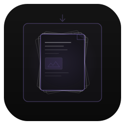
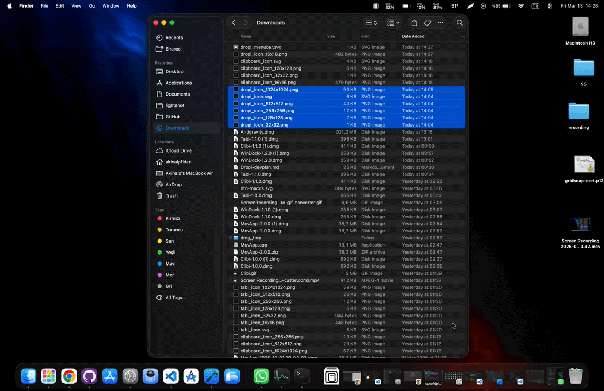
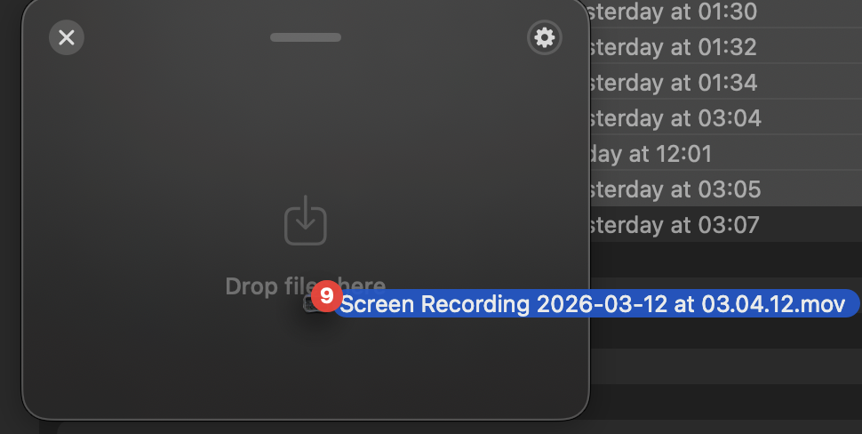
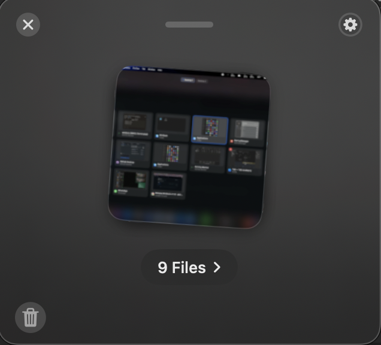
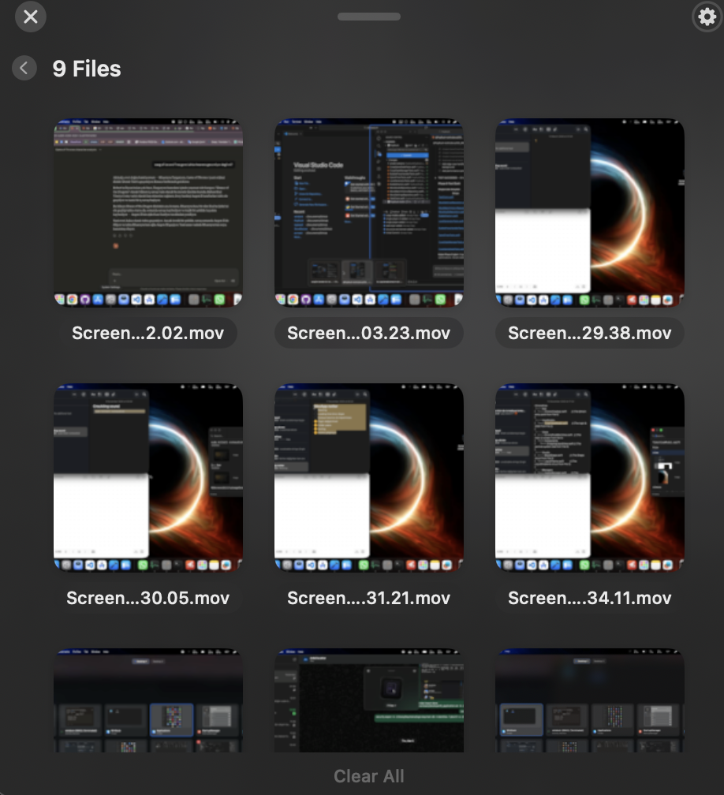
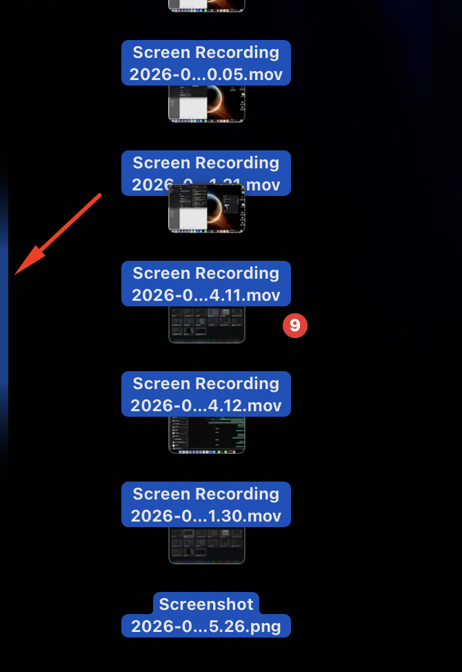

<p align="center">
  
</p>

<h1 align="center">Dropi</h1>

<p align="center">
  A lightweight, open-source file shelf for macOS.<br>
  Drag files in. Drag them out. That's it.
</p>

<h3 align="center">Download</h3>

<p align="center">
  <a href="https://github.com/akinalpfdn/Dropi/releases/latest/download/Dropi.dmg">
    
  </a>
</p>

<p align="center">
  
  
  
</p>

<p align="center">
  
</p>

---

## What is Dropi?

Dropi is a floating file shelf that sits on top of your windows. It gives you a temporary place to hold files while you navigate between folders, apps, or desktops.

No more arranging windows side by side just to move a file. No more losing track of what you were dragging.

**Drop it in. Pick it up later.**

## Why Dropi?

Moving files on macOS often means:
- Resizing windows to see both source and destination
- Opening multiple Finder tabs or windows
- Losing your place when switching between apps
- Dragging across multiple desktops with split-second precision

Dropi eliminates all of that. It's a shelf that floats above everything, appears when you need it, and gets out of the way when you don't.

## Features

- **Multiple triggers** - Shake your mouse, drag to screen edges, or use a keyboard shortcut
- **Edge glow indicators** - Visual cues show where to drag during file operations
- **Drag in, drag out** - Files are automatically removed from the shelf when you drop them elsewhere
- **Multi-file selection** - Click to select, Cmd+click for multiple, drag them all at once
- **Compact and expanded views** - Stack preview for a few files, grid view for many
- **Auto-dismiss** - Shelf closes when you drop files outside of it
- **Lightweight** - Runs as a menu bar app, no dock icon, minimal resource usage
- **Configurable** - Toggle triggers, set custom hotkeys, launch at login
- **Native macOS** - Built with SwiftUI, feels like part of the system

## Screenshots

<table>
  <tr>
    <td align="center"><br><sub>Drop Zone</sub></td>
    <td align="center"><br><sub>Compact View</sub></td>
  </tr>
  <tr>
    <td align="center"><br><sub>Expanded View</sub></td>
    <td align="center"><br><sub>Edge Glow Indicator</sub></td>
  </tr>
</table>

## Installation

### Download
Get the latest release from the [Releases page](https://github.com/akinalpfdn/Dropi/releases/latest).

1. Download `Dropi.dmg`
2. Drag Dropi to your Applications folder
3. Launch Dropi
4. Grant Accessibility permission when prompted (required for mouse triggers)

### Build from Source
```bash
git clone https://github.com/akinalpfdn/Dropi.git
cd Dropi
open Dropi.xcodeproj
```

Build and run with Xcode 15+ targeting macOS 14+.

## Usage

| Action | How |
|--------|-----|
| **Open shelf** | Shake mouse while dragging a file, drag to screen edge, or press hotkey |
| **Add files** | Drag files onto the shelf |
| **Use files** | Drag files out of the shelf to any destination |
| **Select files** | Click a file in expanded view, Cmd+click for multi-select |
| **Remove files** | Drag out to another app (auto-removes), hover and click X, or use Clear All |
| **Settings** | Click the gear icon on the shelf |

## Configuration

Access settings through the gear icon on the shelf:

- **Triggers** - Enable/disable shake, edge, and hotkey triggers independently
- **Hotkey** - Record a custom keyboard shortcut
- **Launch at Login** - Start Dropi automatically
- **Menu Bar Icon** - Show or hide the menu bar icon

## Tech Stack

- Swift 5.9+
- SwiftUI
- AppKit (NSPanel, NSDraggingSource)
- macOS 14 Sonoma+

## Contributing

Contributions are welcome. Please open an issue first to discuss what you'd like to change.

1. Fork the repository
2. Create your feature branch (`git checkout -b feature/your-feature`)
3. Commit your changes
4. Push to the branch
5. Open a Pull Request

## License

[GNU GPLv3](LICENSE)

---

<p align="center">
  Made with care for people who move files around a lot.
</p>
